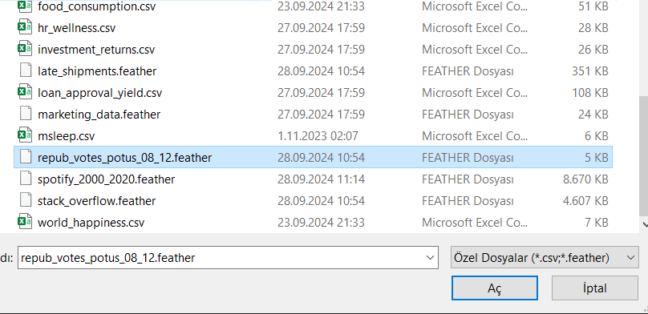
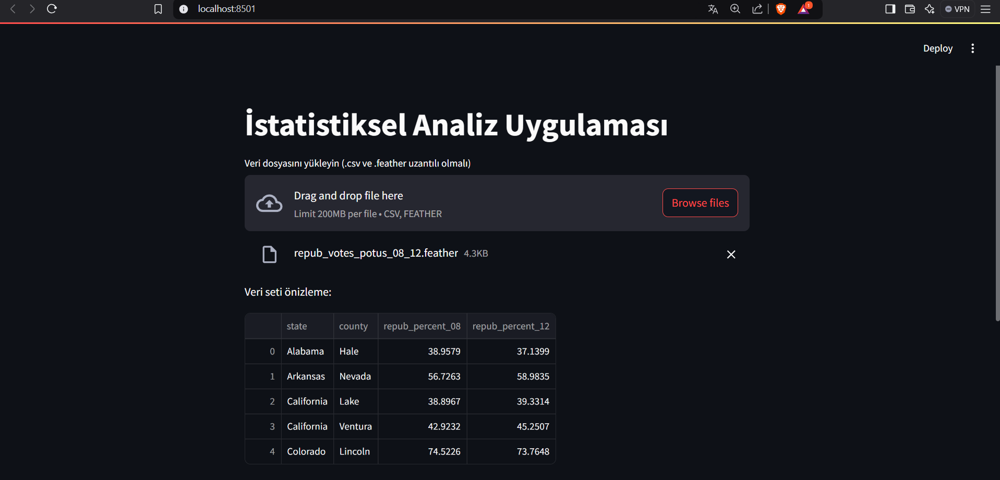
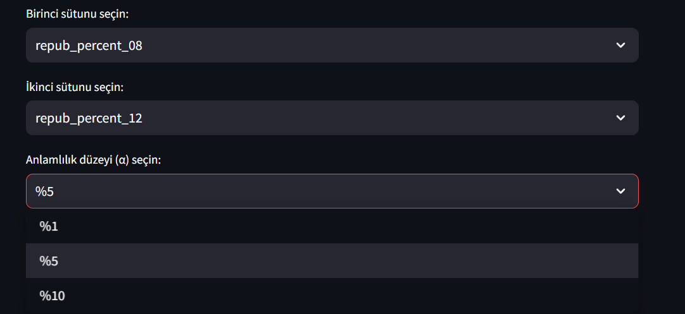
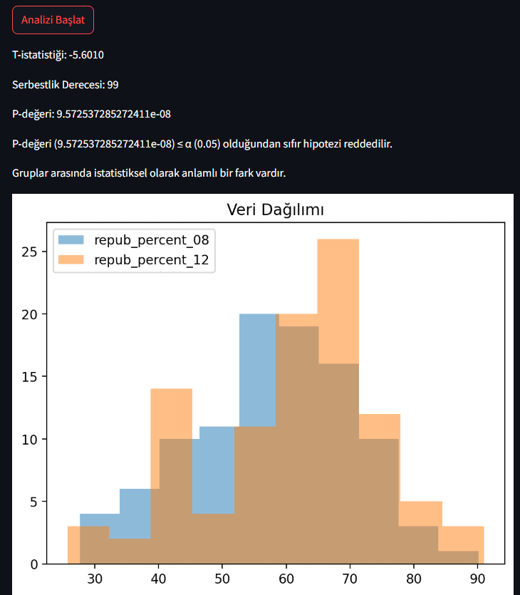

# Veri Madenciliği Stremlit Web Uygulaması

Bu proje, *Veri Madenciliği* kapsamında *Python Streamlit kütüphanesi* kullanılarak geliştirilmiş bir web uygulamasıdır.

### Uygulama Hakkında

Bu web uygulaması aslında temelde kullanıcı tarafından sağlanan veri setinde, yine kullanıcı tarafından sağlanacak olan sütün bilgileri, anlamlılık düzeyi (significance level) gibi değişkenlerin girilmesi istenecektir. Daha sonra verilen değerlere karşılık gelen **t-testi** yapılır, **p-değeri**, **serbestlik derecesi (degrees of freedom)** gibi değerler hesaplanır ve sonra bu değişkenler bir grafikte görselleştirilir.










### Kurulum
```
git clone [https://github.com/Muhammetcansimsek/streamlit.git]

python3 -m venv web_app_env

# for Windows environment
web_app_env\Scripts\activate

pip install -r requirements.txt

streamlit run main.py
```
